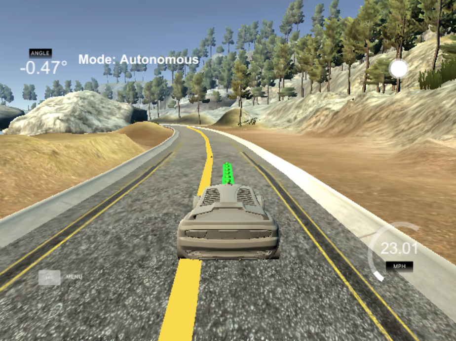

# CarND-Controls-MPC
Self-Driving Car Engineer Nanodegree Program

---
## Overview
The goal of this project was to implement a MPC controller in C++.
* Must be able to handle a 100ms latency
* Navigate a simulation track without falling off course
* Experiment with tunable parameters such as constraints, time steps and duration etc.

## MPC model
The model is kinematic and captures how the car moves given its state. Actuators are able to incluence the state.

State Variables:
- x - vehicle position x
- y - vehicle position y
- psi - orientation
- v - velocity
- cte - cross track error (deviation from function centerline)
- epsi - orientation error

Actuators:
- delta - steering angle
- a - acceleration

The model utilizes update equations to transition state from t -> t+1.

Update Equations:
- x[t+1] = x[t] + v[t] * cos(psi[t]) * dt
- y[t+1] = y[t] + v[t] * sin(psi[t]) * dt
- psi[t+1] = psi[t] + v[t] / Lf * delta[t] * dt
- v[t+1] = v[t] + a[t] * dt
- cte[t+1] = f(x[t]) - y[t] + v[t] * sin(epsi[t]) * dt
- epsi[t+1] = psi[t] - psides[t] + v[t] * delta[t] / Lf * dt

## Timestep Length and Elapsed Duration (N & dt)
The timestep length N is the number of state transitions that are simulated per cycle. The dt is the duration of each step. So T = N*dt.

It's important to pick the right values for these parameters because the larger your T the more information you can predict an optimal solution from. However, when you take into account error and environmental factors, and real-time changes when driving a car, too large a T value will become innaccurate/irrelevant to what the car will actually encounter.

In this project I tried N values in excess off 40 and as low as 5. I found that when the value was > 20 there was a lack of stability (the MPC was relying too much on irrelevant data from the large horizon). To compensate I had to vastly increase my constraint coefficients. However, it was still far from good performance. Very low values made it hard to execute the curves.

I experimented with keeping N fixed and changing dt from values 0.01 -> 0.1. A very low dt made it harder to compute. I also ran into problems with completely wild trajectories on some of the curves where the next_x/y would very briefly loop. A high dt such as 0.1 would not provide enough data relative to an N value between 10-15.

Overall, there was an interesting correlation between T (N*dt) and the parameters I used in my constraints. When T increased I needed to signifcantly increase my constraint penalties to stabilize and perform. A lower T value allowed more useful tuning at the constraint level.

I settled on N = 12 and dt = 0.05 for my final result.

## Polynomial Fitting and MPC Preprocessing
I used a 3rd degree polynomial to fit waypoints. I got this suggestion from the lesson and it makes sense. 3rd degree can capture curves very well and is not too hard to compute.

Before fitting the polynomial I preprocessed the waypoints. I created a function transformCoords that converts the world-points to vehicle coordinates. Once the waypoints were in vehicle coordinates then my CTE, EPSI, and initial state were relative to the vehicle origin and simpler.

## Model Predictive Control with latency
I ran the simulator with 100ms latency through all my tuning and design. I found that it affected performance, especially at higher speeds. It was very easy to tune the model at 30km/h but going 40+km/h became difficult due to the latency. Initially, I had no specific latency handling. I found that one implicit way to account for latency was to tune constraint coefficients that were sensitive to lag. For example, I was able to significantly improve latency handling by multiplying cost of Delta and DeltaGap (difference in magnitute between actuations). This can work because the model will look for ways to decrease number of actuations, and also setup cleaner lines that would be more resiliant to lag.

I then added latency handling after. The technique I chose to use was to predict forward past the latency. Instead of returning the FIRST actuations of the solution, I created a forward index: step = ceil(latency/dt). This gives me the number of steps over the latency period. I then took this index and used it to grab the actuation point further down the solution.

## Final Paremeters (important ones) and Result
- N = 12 timestep length
- dt = 0.05 duration
- rev_v = 70 reference velocity
- coeffDelta = 800.0 cost multiplier for steering actuations
- coeffDeltaGap = 2600.0 cost multiplier for steering intensity
- coeffAcc = 8.0 cost multiplier for acc actuations (lowered braking events)

Real Speed during track traversal ~ 60km/h.
#### Click on the image for video of car doing a lap. https://youtu.be/5J-a7xT6T8A
[](https://youtu.be/5J-a7xT6T8A)


## Dependencies

* cmake >= 3.5
 * All OSes: [click here for installation instructions](https://cmake.org/install/)
* make >= 4.1
  * Linux: make is installed by default on most Linux distros
  * Mac: [install Xcode command line tools to get make](https://developer.apple.com/xcode/features/)
  * Windows: [Click here for installation instructions](http://gnuwin32.sourceforge.net/packages/make.htm)
* gcc/g++ >= 5.4
  * Linux: gcc / g++ is installed by default on most Linux distros
  * Mac: same deal as make - [install Xcode command line tools]((https://developer.apple.com/xcode/features/)
  * Windows: recommend using [MinGW](http://www.mingw.org/)
* [uWebSockets](https://github.com/uWebSockets/uWebSockets)
  * Run either `install-mac.sh` or `install-ubuntu.sh`.
  * If you install from source, checkout to commit `e94b6e1`, i.e.
    ```
    git clone https://github.com/uWebSockets/uWebSockets
    cd uWebSockets
    git checkout e94b6e1
    ```
    Some function signatures have changed in v0.14.x. See [this PR](https://github.com/udacity/CarND-MPC-Project/pull/3) for more details.
* Fortran Compiler
  * Mac: `brew install gcc` (might not be required)
  * Linux: `sudo apt-get install gfortran`. Additionall you have also have to install gcc and g++, `sudo apt-get install gcc g++`. Look in [this Dockerfile](https://github.com/udacity/CarND-MPC-Quizzes/blob/master/Dockerfile) for more info.
* [Ipopt](https://projects.coin-or.org/Ipopt)
  * Mac: `brew install ipopt`
  * Linux
    * You will need a version of Ipopt 3.12.1 or higher. The version available through `apt-get` is 3.11.x. If you can get that version to work great but if not there's a script `install_ipopt.sh` that will install Ipopt. You just need to download the source from the Ipopt [releases page](https://www.coin-or.org/download/source/Ipopt/) or the [Github releases](https://github.com/coin-or/Ipopt/releases) page.
    * Then call `install_ipopt.sh` with the source directory as the first argument, ex: `bash install_ipopt.sh Ipopt-3.12.1`.
  * Windows: TODO. If you can use the Linux subsystem and follow the Linux instructions.
* [CppAD](https://www.coin-or.org/CppAD/)
  * Mac: `brew install cppad`
  * Linux `sudo apt-get install cppad` or equivalent.
  * Windows: TODO. If you can use the Linux subsystem and follow the Linux instructions.
* [Eigen](http://eigen.tuxfamily.org/index.php?title=Main_Page). This is already part of the repo so you shouldn't have to worry about it.
* Simulator. You can download these from the [releases tab](https://github.com/udacity/self-driving-car-sim/releases).
* Not a dependency but read the [DATA.md](./DATA.md) for a description of the data sent back from the simulator.


## Basic Build Instructions


1. Clone this repo.
2. Make a build directory: `mkdir build && cd build`
3. Compile: `cmake .. && make`
4. Run it: `./mpc`.
